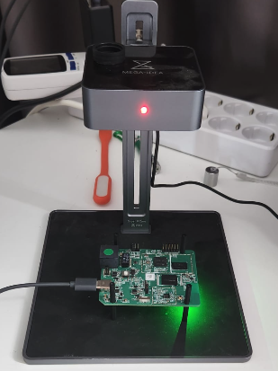
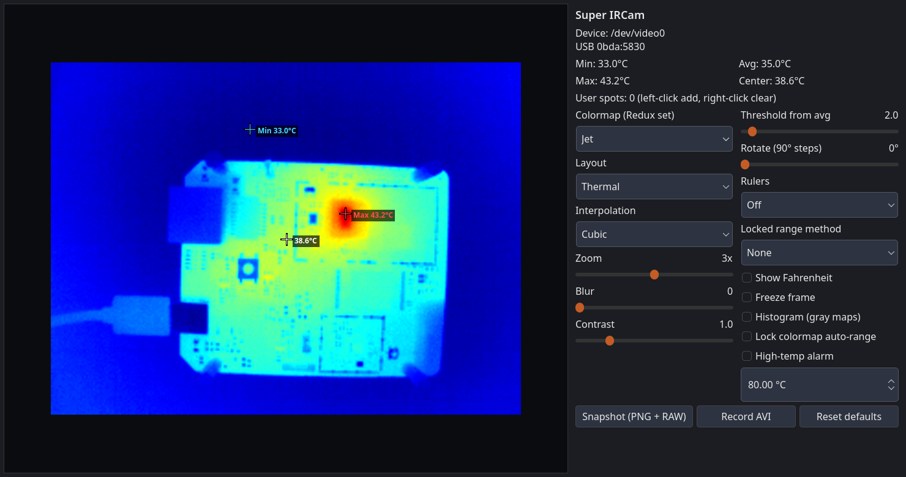
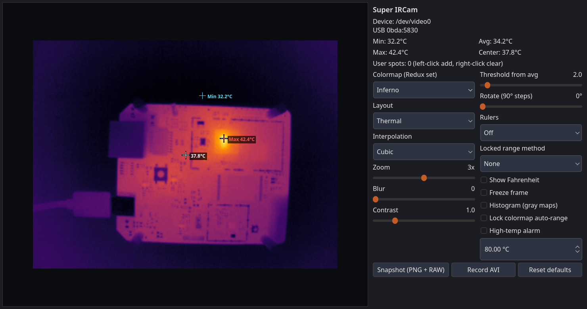
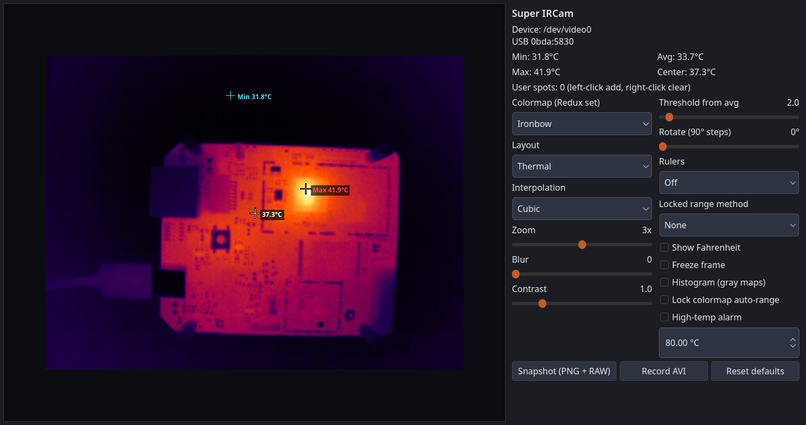
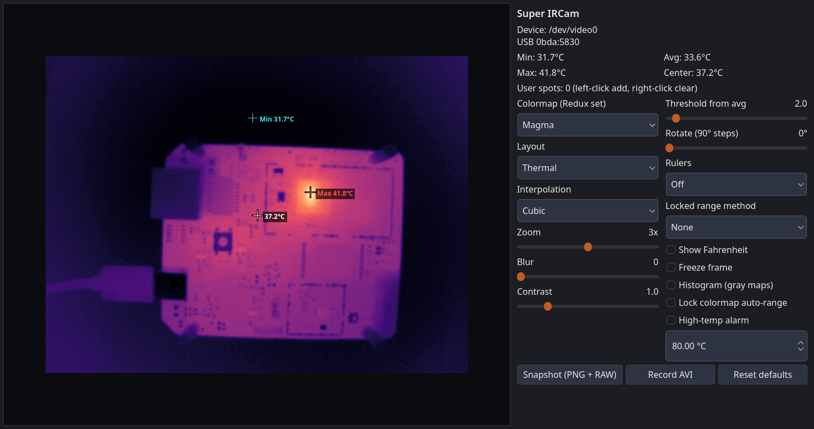
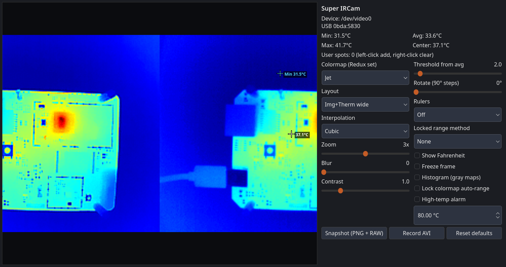
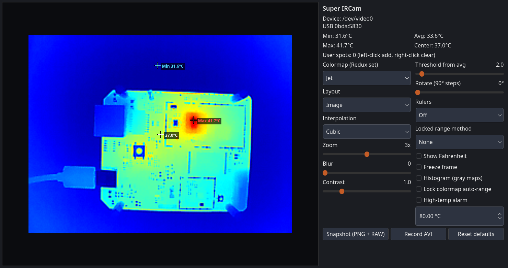

# Super IRCam

Qt 6 desktop viewer for the Qianli Super IRCam Pro 2S (and other InfiRay-family
USB modules that appear as UVC `0bda:5830`).

Inspired by [Thermal-Camera-Redux](https://github.com/92es/Thermal-Camera-Redux),
but developed as a new application from scratch. Super IRCam does not fork,
link, exec, or vendor Redux source. It is an independent C++ program.

## Hardware

Qianli Super IRCam Pro 2S (MESA-IDEA stand) over a PCB:



## Screenshots

Default Jet view with on-image min / max / center temperatures and the
two-column control panel:



Inferno, Ironbow, and Magma on the same scene:







Image + thermal side-by-side layout:



Visual-only layout (camera Y plane):



## Redux vs Super IRCam

**Thermal-Camera-Redux** is a keyboard-and-OSD Linux app built around OpenCV
HighGUI (`src/tc001.cpp`). It opens the camera with OpenCV, draws menus on the
video window, and is launched as the `redux` command.

**Super IRCam** is a separate codebase written from scratch with:

- raw **V4L2** capture (mmap YUYV 256×384)
- **Qt 6** widgets for the button GUI
- **OpenCV** only for colormap, resize, PNG, and AVI

Both talk to the same USB radiometry format (lower 256×192 of the 256×384
YUYV frame holds 16-bit Kelvin; `T°C = raw/64 − 273.15`) and Super IRCam
reimplements the Redux colormap set and overlay behaviour. Installing
`thermal-camera-redux` is not required for `super-ircam` to run.

## License

The thermal viewer lineage and its prior licenses belong to
[Thermal-Camera-Redux](https://github.com/92es/Thermal-Camera-Redux) and
[PyThermalCamera](https://github.com/leswright1977/PyThermalCamera). We did
not relicense that work. This repository is original Qt GUI source plus Debian
packaging. See [LICENSE](LICENSE).

Related Redux packaging fork (CLI `redux`, Docker `.deb` build, desktop-launch
stdin fix):

https://github.com/stulluk/Thermal-Camera-Redux

## Features

- Auto-select USB `0bda:5830` (does not open a normal webcam)
- 37 Redux colormaps, 7 interpolations, 4 layouts
- On-image max / min / center crosshairs with °C (or °F)
- Up to 12 user spots (left-click add, right-click clear)
- Snapshot PNG+RAW and AVI recording (XVID / MJPG)
- Start-menu and desktop launcher icons

## Build the `.deb` with Docker

Host packages are not required. Docker builds the binary and writes
`dist/super-ircam_0.2.0-1_amd64.deb`.

```bash
./dockerbuild.sh
./indockerbuild.sh
sudo dpkg -i dist/super-ircam_0.2.0-1_amd64.deb
```

The image is `debian:sid` with Qt 6 and OpenCV. The resulting package is
meant for Debian sid/forky (depends on `libqt6*` and `libopencv-*-410`).

If this tree also contains `third_party/Thermal-Camera-Redux` (local
development checkout), `indockerbuild.sh` builds the Redux `.deb` as well.
The public GitHub tree does not vendor Redux; build that package from
https://github.com/stulluk/Thermal-Camera-Redux instead.

Every push to `main` also builds the `.deb` on GitHub Actions
(`.github/workflows/deb.yml`). Download the `super-ircam-deb` artifact from
the workflow run.

## Run

```bash
super-ircam
```

Optional:

```bash
super-ircam --screenshot /tmp/window.png --quit-after-shot
```

Plug in the thermal module first. After NUC/FFC (about 3 seconds of
`0x8000` frames) the image and overlays appear.

## Two-column control panel

The right-hand controls use two columns so a typical window height does not
need a scrollbar. If you prefer the older single-column scrolling sidebar,
revert the commit that introduced the two-column layout (it is a standalone
change on `main`).
